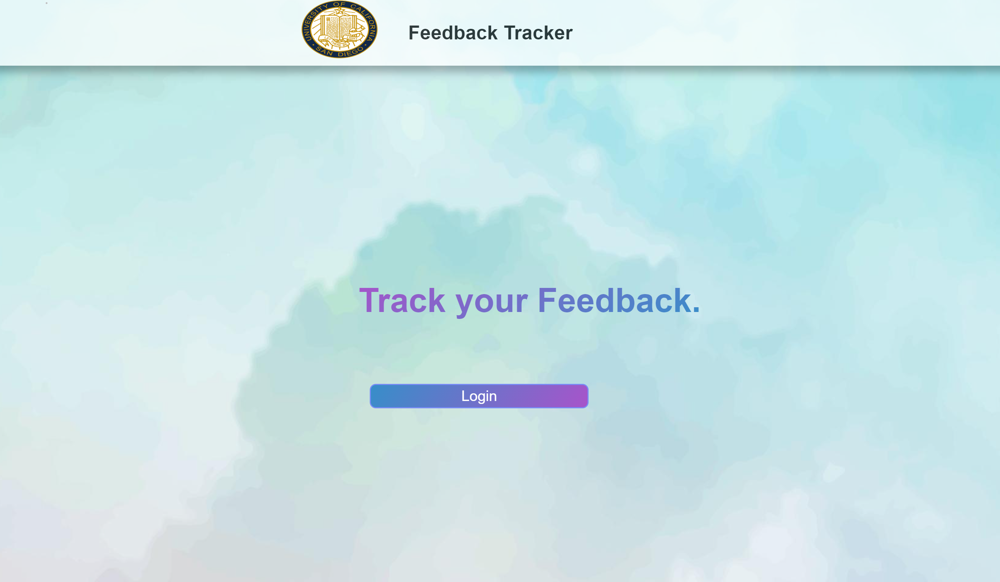
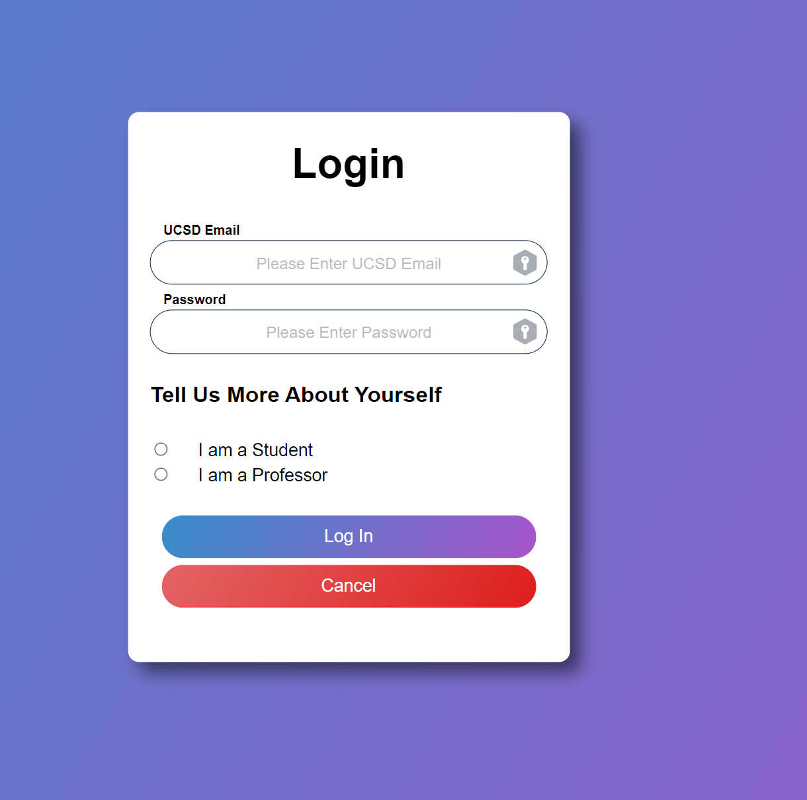
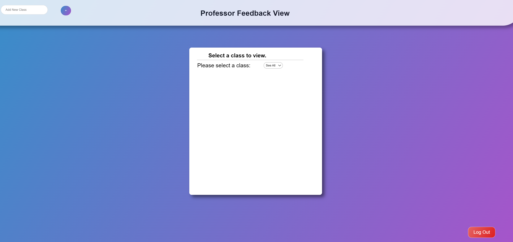
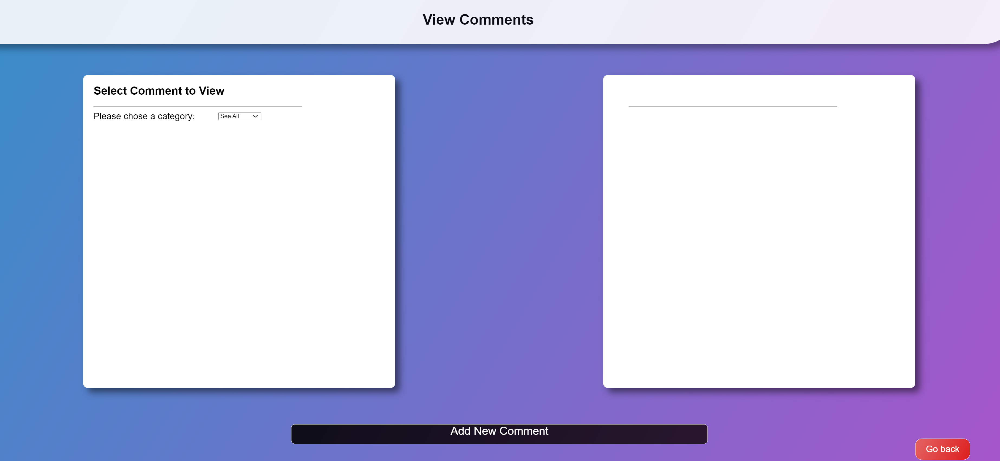
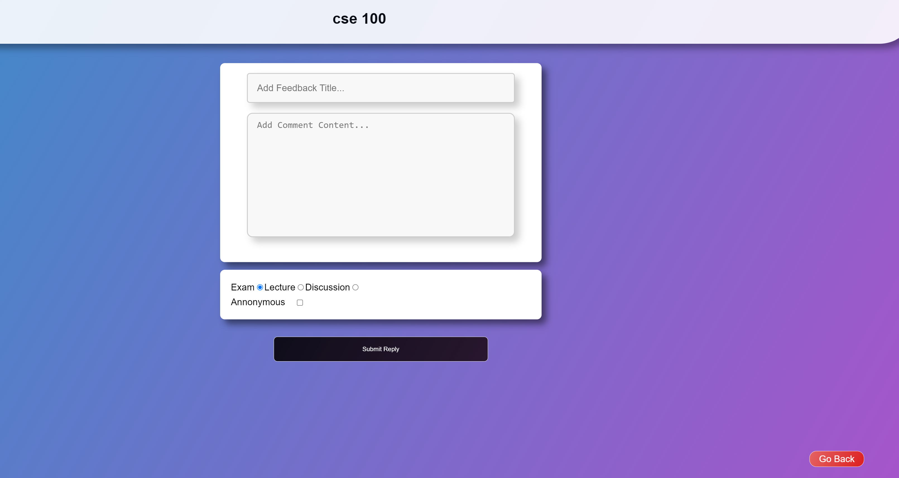
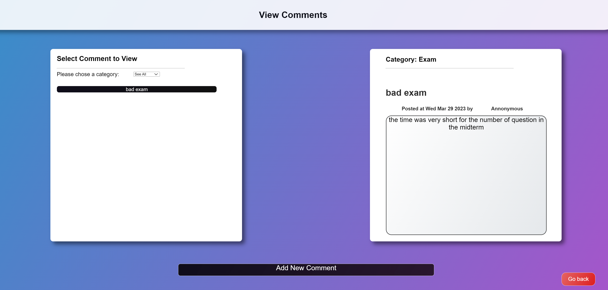

<!--# This is a readme file for cse 110 fall 2022 group 31 github.  _-->
 <!-- logo -->
# Professor Feedback App

This is a web application designed to collect and manage feedback from students about their professors. It allows students to rate their professors on various criteria and leave comments about their experiences. Home page: This is the landing page of the application, which includes a brief description of the purpose and features of the application.

Login and registration pages: These pages allow users to create new accounts or log in to existing accounts.

Professor directory page: This page displays a list of all the professors in the system, along with their ratings and comments.

Professor details page: This page shows detailed information about a specific professor, including their name, department, ratings, and comments.

Feedback submission page: This page allows students to submit feedback on a particular professor.

Admin dashboard: This page is accessible only to administrators and provides them with a way to manage feedback and professors. It includes functionality such as editing or deleting feedback and adding or removing professors.

## Features

- Student login and registration
- Professor directory with ratings and comments
- Ability for students to submit feedback on a professor
- Admin dashboard for managing feedback and professors

## Technologies Used

- Node.js
- Express.js
- MongoDB
- Bootstrap

## Installation

1. Clone the repository:git clone https://github.com/naseralemi12/Professor-Feedback-App.git

## Languages Used
- HTML, CSS, JavaScript, Python, SQL

# Link: [Team Page](https://github.com/cse110-fa22-group31/cse110-fa22-group31/blob/main/admin/team.md)

   <!--drop down description  menu for info about team members -->

<h2>About Us:</h2>

<ul><!-- in the lines below, feel free to write about yourself. feel free to add your pictures as well if its ok -->
<li>Ananya De is the team manager.</li>
<li>Ricardo Aguilar is the team leader.</li>
<li>Holden Adamec is a dev.</li> 
<li>Jacwa Lei is a dev.</li>  
<li>Harrison Kung is a team lead. He likes to bike and enjoys playing the piano.</li>  
<li>Christian Velasquez is a dev.</li>  
<li>Thomas Rexin is a designer.</li>  
<li>Adam Alemi is one of the team members. When He gets stressed, he goes to the pool and swims all the stress out of his body. He is foody so if there is an event on campus that has food involved, then you will most likely see him there. Adam's personal page:<a href="https://chipper-kitsune-d5866b.netlify.app/"> Adam Alemi</a>. </li>

 
<li>Meihui Liu is a planner.</li>  
<li>Chris Chen is a dev.</li>  
<li>Kenny Fong is a dev.</li>  
</ul>

<h3>Team Manager: Ananya De</h3> 
<table> <!-- The raster table for the team members containing two columns of name and page links -->
<caption><strong>TEAM MEMBERS</strong></caption><tbody><tr><th><b>Name</b></th><td><b>Github Page</b></td></tr>
<tr><th>Ricardo Aguilar</th><td><a href="https://github.com/Aricky3">Github Page</a></td></tr>
<tr><th>Holden Adamec</th><td>hackerlife.tech</td></tr>
<tr><th>Jacwa Lei</th><td><a href="https://github.com/jacwa-lei">Github Page</a></td></tr>
<tr><th>Harrison Kung</th><td><a href="https://github.com/kungharrison">Harrison's Git Page<a></td></tr>
<tr><th>Christian Velasquez</th><td><a href="https://github.com/AmnesiacSloth">Github Page</a></td></tr>
<tr><th>Thomas Rexin</th><td><a href="https://github.com/thomasrexin">Github Page</a></td></tr>
 <tr><th>Adam Alemi</th><td><a href="https://github.com/naseralemi12">Adam's Github</a></td></tr>
 <tr><th>Meihui Liu</th><td><a href="https://github.com/number000000">Github Page</a></td></tr>
<tr><th>Chris Chen</th><td><a href="https://github.com/ChrisChen0803">Github Page</a></td></tr>
<tr><th>Kenny Fong</th><td><a href="https://github.com/KenKunoo">Github Page</a></td></tr>
</tbody></table>

## Demo Video
<>

## Sample Output

