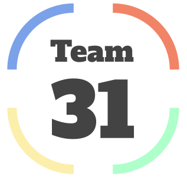
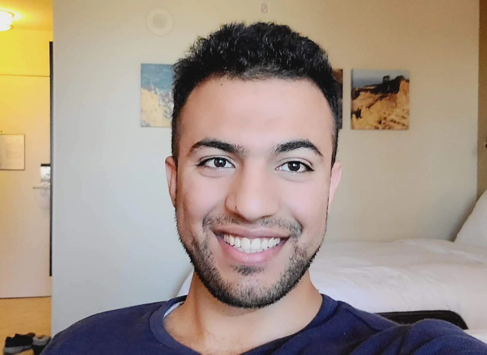

<!--# This is a readme file for cse 110 fall 2022 group 31 github.  _-->

# Link: [Team Page](https://github.com/cse110-fa22-group31/cse110-fa22-group31/blob/main/admin/team.md)

About Us:

<ul>
<li>Ananya De is the Team manager. she like to do ........ in her free time.</li>
<li>Ricardo Aguilar is the team leader. He likes to.......</li>
<li>Holden Adamec</li>
<li>Jacwa Lei</li>  
<li>Harrison Kung</li>  
<li>Christian Velasquez</li>  
<li>Thomas Rexin</li>  
Adam Alemi is one of the team members. When He gets stressed, he goes to the pool and swims all the stress out of his body. He is foody so if there is an event on campus that has food involved, then you will most likely see him there.</li>

 
<li>Meihui Liu</li>  
<li>Chris Chen</li>  
<li>Kenny Fong</li>  
</ul>

# Team Manager:Ananya De
<table>
<caption><strong>TEAM MEMBERS</strong></stron></caption><tbody><tr><th>Name</th><td>Github Page</td></tr>
<tr><th>Ricardo Aguilar</th><td>Github Page</td></tr>
<tr><th>Holden Adamec</th><td>[Github Page](hackerlife.tech)</td></tr>
<tr><th>Jacwa Lei</th><td>Github Page</td></tr>
<tr><th>Harrison Kung</th><td>Github Page</td></tr>
<tr><th>Christian Velasquez</th><td>Github Page</td></tr>
<tr><th>Thomas Rexin</th><td>Github Page</td></tr>
<tr><th>Adam Alemi</th><td>[Github Page](https://github.com/naseralemi12)</td></tr>
<tr><th>Meihui Liu</th><td>Github Page</td></tr>
<tr><th>Chris Chen</th><td>Github Page</td></tr>
<tr><th>Kenny Fong</th><td>Github Page</td></tr>
</tbody></table>

