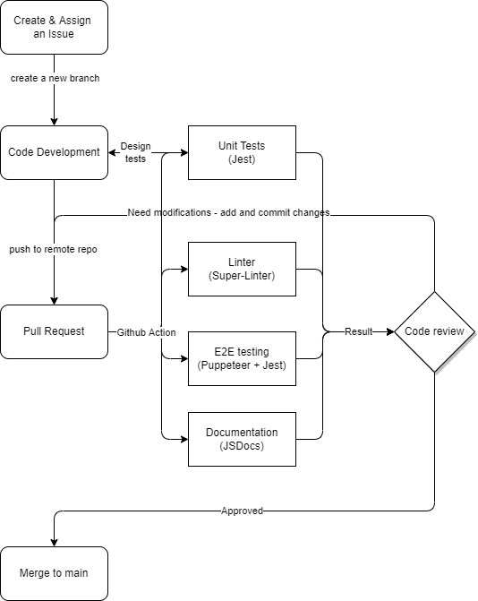

# Phase 1 Report - Check Point 1
The functioning of our CI/CD pipeline is based on GitHub Action. When developers create a pull request, the GitHub Action will be triggered and a list of actions will be run on the code to determine if the push meets our requirements. In addtion to Github Action and automated tests we created, we also rely on manual supervision on our code as we have two code reviewers who make the final decision on whether or not a branch should be merged with main.

## What we currently have
1. Deployed a [basic linter](/.github/workflows/lint.yml) that uses Super-Linter to check for coding style/conventions and programming errors.
2. Have a [template](/Source/testing/tests.js) for unit testing. Unit testing is implemented into the Github Action.
3. Assigned two [reviewers(Holden Adamec, Harrison Kung)](/CODEOWNERS) to do code reviewing.
4. [Wiki page](https://github.com/cse110-fa22-group31/cse110-fa22-group31/wiki/Testing#unit-testing) on how to create Unit Tests.

## Planned and In-Progress
1. Currently developing end-to-end tests using Puppeteer and Jest to test our web app functionalities.
2. Improve the linter we have by reducing strictness.
3. If time allows, we can implement JSDocs to automate the generation of documentation for Javascript files. Otherwise, we can add documentation manually to GitHub Wiki and it wouldn't take too much time given the small size of our project.

## Diagram

